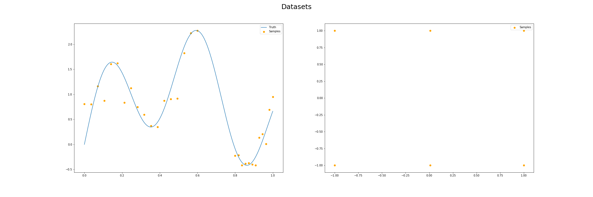
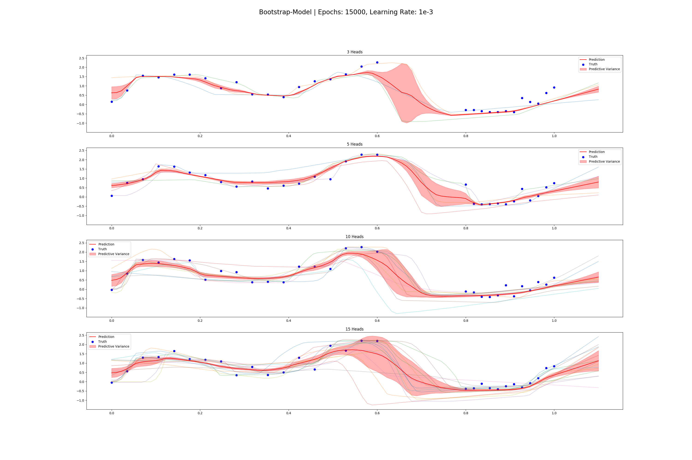

# Uncertainty in Neural Networks

This project contains different implementation and evaluations of approaches to model
uncertainty in neural networks.

- Bootstrapping-Method from Osband et al.
- (Monte Carlo)Dropout-Method by Gal
- Combined method (heteroscedastic aleatoric + epistemic) from Kendal & Gal
- Mixture Density Networks as used by Choi et al.

Those models are evaluated on 2D data for function approximation. Specifically there is a dataset 
having six points at (-1,1) , (-1,-1), (0,1), (0,-1), (1,1), (1,-1) which shows problems with
the Dropout and Combined Method. And a ''x + sin(x)'' function with added noise.

Additionally the evaluation is done on MNIST data, for which I crafted adversarial attacks
to evaluate the effectiveness of the Uncertainty methods.

## Methods

### Bootstrapping
The idea is to have a network with k distinct heads that share a network. The dataset
is masked, so that every head only sees a subset of all data. Predictive variance and mean
can then be gained by averaging over the prediction of every head.

https://arxiv.org/pdf/1602.04621v3.pdf

### Monte-Carlo Dropout
Using dropout during training and test time which is approximate variational inference.
Mean and variance is gained by doing stochastic forward passes (MC Dropout) and averaging
over the outputs. This model can't differentiate between aleatoric and epistemic uncertainty.

http://mlg.eng.cam.ac.uk/yarin/thesis/thesis.pdf

### Combined (Aleatoric + Epistemic Uncertainty) Method
Using Monte-Carlo Dropout and a modified loss function, you can get heteroscedastic aleatoric and
epistemic uncertainty separated and also combine them.

https://arxiv.org/pdf/1703.04977.pdf

### Mixture Density Networks
The last layer(s) are replaced by a layer that output Gaussian Mixture Models. 

https://arxiv.org/pdf/1709.02249.pdf

## Results
Results can be found in `results` or generated with

- `python evaluation/boostrap_evaluation.py`
- `python evaluation/combined_evaluation.py`
- `python evaluation/dropout_evaluation.py`
- `python evaluation/mixture_evaluation.py`

or all at once with `python evaluation/evaluate_all.py`

## TODO
- Working with higher dimensional data (MNIST)
- Analyze influence of adversarial attacks

## Problems
- When running on the command-line, you might have to set $PYTHONPATH to the root dir: `export PYTHONPATH=.`  

